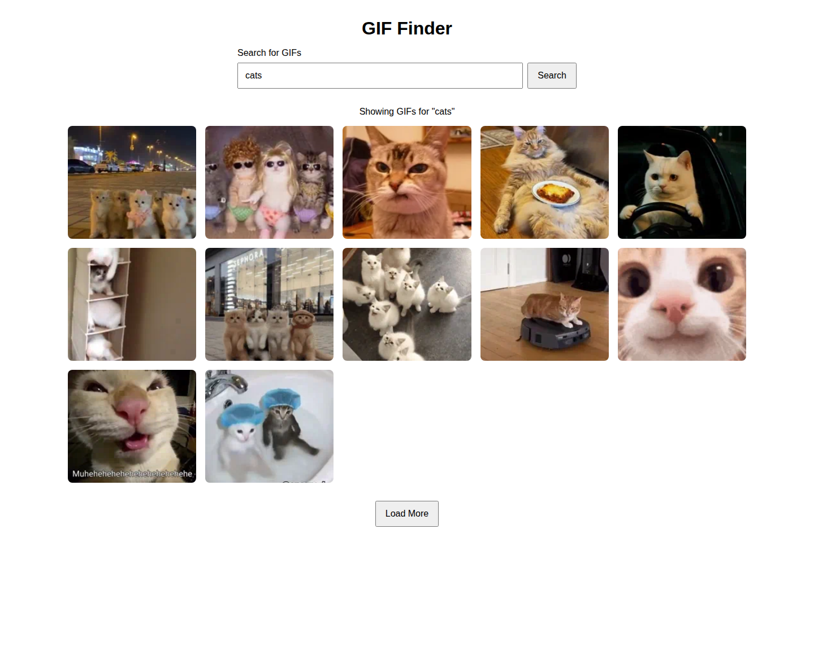
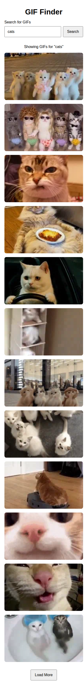

# GIF Finder

A simple and responsive GIF search application built with **HTML, CSS, and vanilla JavaScript**. The application uses the
**GIPHY API** to search for GIFs based on user provided keywords and allows users to load additional results without starting
a new search.

---

## [Live Demo](https://pbain63.github.io/Project_Working-with-APIs)

---

## Screenshots

| Desktop View                             | Mobile View                            |
| ---------------------------------------- | -------------------------------------- |
|  |  |

---

## Features

- Search for GIFs using keywords
- Fetch GIFs from the GIPHY Search API
- Display search results in a responsive CSS Grid
- Load additional GIFs with the **Load More** button
- Displays a message when no GIFs are found
- Displays loading and error states
- Prevents empty searches
- Uses lazy loading for GIF images
- Uses accessible form labels and status messaging
- Uses `DocumentFragment` to efficiently add multiple GIF elements to the DOM
- Supports pagination through the GIPHY API's `offset` parameter

---

## Technologies Used

- **HTML5**
- **CSS3**

  - CSS Grid
  - Flexbox
  - Responsive layout

- **JavaScript (ES6+)**

  - `async/await`
  - Fetch API
  - DOM manipulation
  - Event listeners
  - URL and URLSearchParams APIs
  - DocumentFragment

- **GIPHY API**

---

## How It Works

The application has three main parts:

### 1. Search for GIFs

Users enter a search term into the search form.

When the form is submitted, JavaScript:

1. Gets the search term.
2. Removes unnecessary whitespace.
3. Validates that the input is not empty.
4. Clears previous results.
5. Resets the pagination offset.
6. Requests GIFs from the GIPHY API.
7. Displays the returned GIFs.

The search form is implemented using a semantic HTML `<form>` element.

### 2. Display GIF Results

Each GIF returned by the API is converted into an HTML `<article>` element containing an image.

The application uses the GIPHY `fixed_width.webp` image format and enables native lazy loading:

```javascript
image.src = gif.images.fixed_width.webp;
image.alt = gif.alt_text || "GIF";
image.loading = "lazy";
```

This helps avoid loading all images immediately when there are many results.

The GIF cards are displayed using CSS Grid, allowing the number of columns to adapt to the available screen width.

### 3. Load More Results

The application retrieves **12 GIFs per request**:

```javascript
const GIFS_PER_PAGE = 12;
```

The current offset is then increased by the number of GIFs returned by the API. This allows subsequent requests to retrieve the next set of results.
If there are no more results, the application hides the **Load More** button and informs the user.

---

## Project Structure

```text
gif-finder/
│
├── index.html
├── styles.css
├── main.js
└── README.md
```

### File Responsibilities

| File         | Purpose                                                                       |
| ------------ | ----------------------------------------------------------------------------- |
| `index.html` | Defines the application's structure and search interface                      |
| `styles.css` | Provides layout, responsive styling, and GIF card styles                      |
| `main.js`    | Handles API requests, searching, rendering, pagination, and user interactions |
| `README.md`  | Project documentation                                                         |

---

## API Integration

This project uses the **GIPHY Search API**.

The application sends the following information to the API:

- `api_key` — GIPHY API authentication
- `q` — user's search term
- `limit` — number of GIFs requested
- `offset` — pagination offset
- `rating` — content rating

The API request is constructed using `URL` and `URLSearchParams`, which keeps query string construction structured and readable.

---

## Error Handling

The application handles several common situations:

### Empty Search

If the user submits the form without entering a search term, the application displays:

```text
Please enter something to search for.
```

### No Results

If the API returns an empty data array, the application informs the user that no GIFs were found for the requested search term.

### API Errors

If the HTTP request fails, the application catches the error and displays a user friendly error message instead of leaving the interface in an unusable state.

---

## Accessibility

Some accessibility considerations included in the project are:

- Semantic `<form>` element for the search interface
- `<label>` associated with the search input
- Descriptive `alt` text for GIF images
- `aria-live="polite"` for status messages
- `aria-label` for the GIF results section
- Keyboard accessible form submission
- Native lazy loading for images

The status message and results section are explicitly represented in the HTML with ARIA attributes.

---

## Getting Started

### Prerequisites

You only need:

- A modern web browser
- A GIPHY API key
- A local development server such as VS Code Live Server, if desired

### Installation

1. Clone the repository:

```bash
git clone https://github.com/pbain63/Project_Working-with-APIs.git
```

2. Navigate to the project directory:

```bash
cd Project_Working-with-APIs
```

3. Configure your API credentials securely.

4. Start the project using a local development server.

5. Open the application in your browser.

---

## Security Note

**Do not commit your GIPHY API key to a public GitHub repository.**

The current project places the API key directly in `main.js`.

For learning purposes, this demonstrates how API authentication works on the client side. However, a production application should not expose a private API credential in browser JavaScript.

A more secure architecture would be:

```text
Browser
   │
   │ Search request
   ▼
Backend / Serverless Function
   │
   │ API request + secret API key
   ▼
GIPHY API
   │
   ▼
Backend / Serverless Function
   │
   ▼
Browser
```

The API key should be stored as an environment variable on the server rather than committed to Git.

If a real API key has already been pushed to GitHub, **revoke or rotate it immediately**.

---

## Future Improvements

Possible improvements for future versions include:

- Add a backend/serverless API proxy to protect the API key
- Add GIF loading skeletons
- Add a retry button for failed requests
- Disable the search button while a search is in progress
- Improve responsive typography and spacing
- Add GIF titles and attribution
- Add a "Back to top" button
- Add keyboard focused states
- Add debounce behavior for search as you type
- Add unit tests
- Add automated deployment with GitHub Actions
- Add pagination controls or infinite scrolling
- Improve API response validation

---

## What I Learned

This project helped reinforce several important JavaScript concepts:

- Working with third party REST APIs
- Using the Fetch API
- Working with `async/await`
- Handling asynchronous operations
- Using `URL` and `URLSearchParams`
- Manipulating the DOM
- Creating reusable rendering functions
- Using `DocumentFragment`
- Handling API errors
- Implementing pagination with an API offset
- Managing application state with JavaScript variables
- Working with browser events
- Improving image loading performance with lazy loading

---

## License

This project is available for educational and portfolio purposes.

---

## Acknowledgements

- GIF data provided by the [GIPHY API](https://developers.giphy.com/)
- Built as a frontend JavaScript practice project.

---
